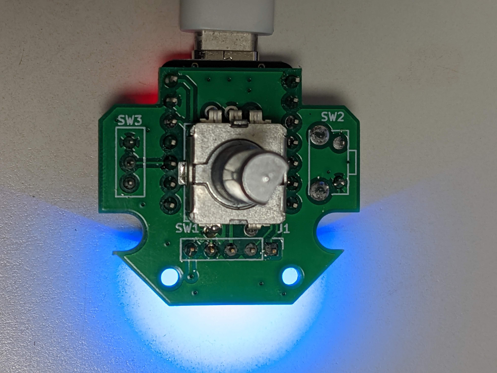

# Back To the Meeting Switch (BTMS) 【緊急】会議復帰スイッチ

## What is BTMS?

BTMS (Back To the Meeting Switch) is a kind of human interface device that using Seeeduino Xiao (SAMD or RP2040).
With this item, we can get back to online meeting right away even though we're doing other things during the online meeting. This is the main purpose of this device. But this has expansion port (compatible with Grove connector)  at the back side of this device and can easily attach some external button as the Dock of BTMS.

For details, plase watch the video below!

## The mechanism

The main operation of this device is just rotate and push the knob. When rotate the knob, this device sends "Alt+TAB" or "Alt+Shift+TAB" according to the rotating direction of the knob for switch to transit to current online meeting window.

After selected the online meeting window now you are attending to, just press the knob to select the window. And at the same time, this device sends the mute toggle key event (Keyboard shortcut) to the selected application.

Mute toggle event is different per video communication applications (e.g. Microsoft Teams, Zoom or Skype, etc).
(For example, Microsoft Teams uses togging the mute by "Ctrl+Shift+M", for WebEx, "Ctrl+M")

So, user set the current communication application to the BTMS and the device uses application-dedicated mute shortcuts for mute toggle key event.

To select the application, just long-press side tactile switch.

## About the expansion port

On the bottom side of the device, there is 5 pin connector for expand the functionality of this device.
The signal of this connector is based on Grove connector (I2C), so that many kind of another interface could be added as a dock.

Now we are developing 6-mechanical-keys-dock for application dedicated controller. (For example, send keyevents specialized for Illustrator, Fusion360, etc.)

## Resources
In this repository there are 3 folders so far.

- hardware 
KiCad Design files and schematic in pdf.
- software 
Main sourcecode witten in Python(Circuit Python)

Later we'll add 3D Modeling data that could be print out with 3D Printer.

We'll write step-by-step instruction guide later.

This PCBs are created with Seeed FusionPCB!!

## Links

1) Seeed XIAO RP2040: https://www.seeedstudio.com/XIAO-RP2040-v1-0-p-5026.html
2) Seeed Fusion PCBA Service: https://www.seeedstudio.com/pcb-assembly.html
3) Seeed Fusion DIY XIAO Mechanical Keyboard Contest: https://www.seeedstudio.com/seeed-fusion-diy-xiao-mechanical-keyboard-contest.html