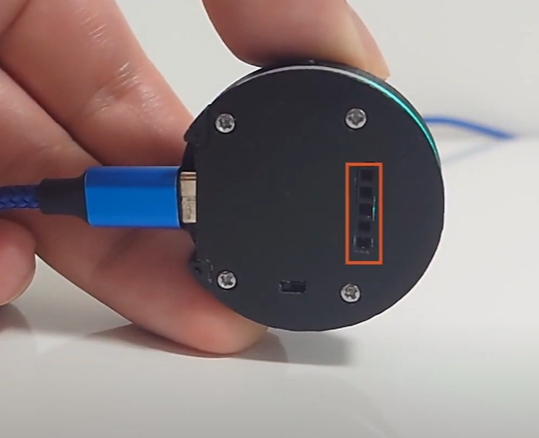
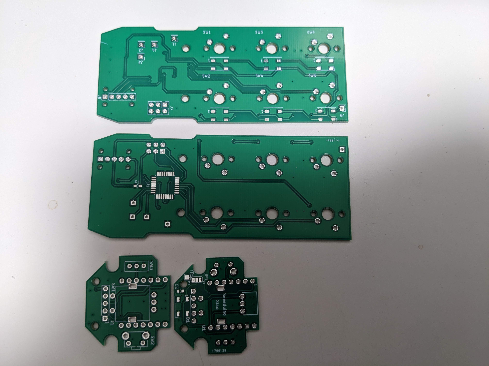

# Back To the Meeting Switch (BTMS) 【緊急】会議復帰スイッチ

## 背景ストーリー
聞いているだけでいいと思っていたオンライン会議、急にコメントを求められると、焦ってしまってすぐに戻ることができません。
そこで、【緊急】会議復帰スイッチを開発しました。
スイッチを回して復帰するミーティングアプリを選択します。
そしてスイッチを押すと、そのアプリが最前面に表示され、同時にマイクのミュートも外れます。

安心して ~~内職~~ 会議に参加してください。

## 【緊急】会議復帰スイッチ(BTMS)とは?

【緊急】会議復帰スイッチ(BTMS)は Seeduino Xiao RP2040を使用したノブ型のヒューマンインターフェースデバイスです。
オンラインミーティング中に他の作業をしてしまっていたとしても、即座にオンラインミーティングに戻ることができます。これが本品のメイン機能ですが、更に底面に搭載した拡張端子(Grove相当の信号)があるので、本ノブのドック的な形でボタンを追加したりすることが簡単に行えます。

詳細は、下のビデオで紹介しているので是非見てください!

## 仕組み

本ノブの基本操作は、ノブの回転と押下です。ノブを回転すると、回転方向に応じて、「Alt+TAB」または「Alt+Shift+TAB」を送信し、参加中のオンラインミーティングに切り替える事ができます。

そして、参加中のオンラインミーティングアプリを選択後、ノブを押下すると、そのアプリを選択すると同時に、マイクミュートのショートカットキーイベントを送信します。

ミュートショートカットイベントは、オンラインミーティングアプリ(Microsoft TeamsやZoom、SkypeE等)により異なります。(Microsoft Teamsではミュートトグルのショートカットキーが「Ctrl+Shift+M」、WebExは「Ctrl+M」等)

なので事前にどのアプリを使用するか?を本機に指定しておくことでそのアプリに合ったミュートショートカットキーを送出するようにしています。
アプリの選択は、サイドにあるボタンを長押しすることで実施可能です。

## 拡張端子について

本機底面に機能拡張用の5ピンコネクタを用意しています。
コネクタの信号はGrove(I2C)に準じているので、様々な機能をドックとして追加することが可能です。

現在は6ボタンドックというアプリ操作用(左手デバイス)キーボードを準備中です。(イラレとか、Fusion360等でよく使用するキーイベントを登録して使用できる)

## ソースコード
本githubリポジトリには現在、以下のフォルダがあります。

- hardware 
KiCadの基板設計データと回路図pdf
- software 
CircuitPythonで実装したノブ側のファームウェア
- case
3Dプリンタで出力できる筐体のデザインデータ

作り方のガイドは別途まとめる予定です。

基板は、SeeedのFucionPCBで作成しました。

## リンク

1) Seeed XIAO RP2040: https://www.seeedstudio.com/XIAO-RP2040-v1-0-p-5026.html
2) Seeed Fusion PCBA Service: https://www.seeedstudio.com/pcb-assembly.html
3) Seeed Fusion DIY XIAO Mechanical Keyboard Contest: https://www.seeedstudio.com/seeed-fusion-diy-xiao-mechanical-keyboard-contest.html

## 開発者
yishii Twitter : https://twitter.com/yishii

dabyoonig Twitter  : https://twitter.com/dabyoong
